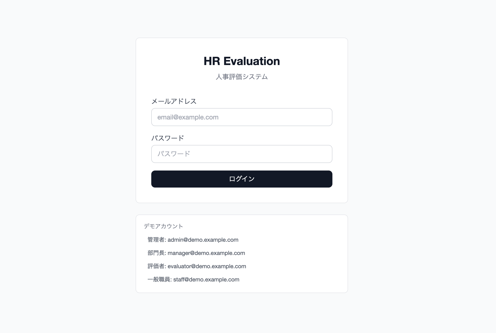
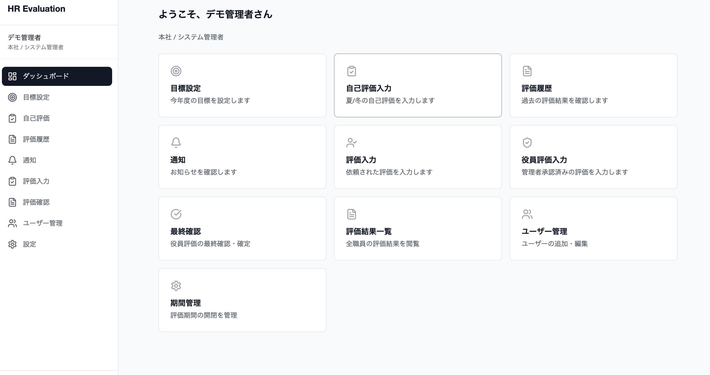
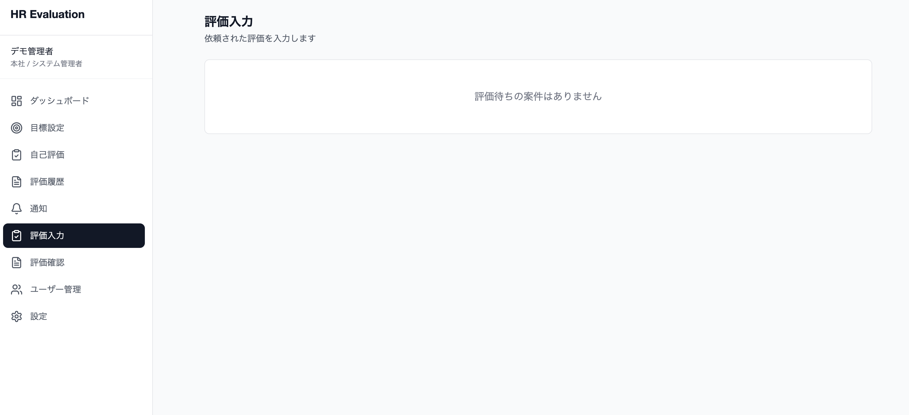

# HR Evaluation System（人事評価システム）

マルチテナント対応の汎用人事評価SaaSシステム。  
目標管理（MBO）ベースの **5段階評価ワークフロー** を備え、自己評価 → 評価者 → 管理者 → 役員 → 最終確定 の承認フローを一気通貫で管理します。

> ** ポートフォリオ概要**  
> 社会福祉法人の保育施設で実運用中の人事評価システム（PHP / 約5,800行）を、  
> エンタープライズ向けモダンスタックで再設計・再構築したプロジェクトです。  
> 約5,400行のコードで同等機能を実現し、マルチテナント化・REST API化・テスト追加を行いました。

---

## 画面イメージ

### ログイン画面


### ダッシュボード（管理者）


### 評価入力画面

---

## 技術スタック

| レイヤー | 技術 |
|---------|------|
| **Backend** | Java 21 / Spring Boot 3.4 / Spring Security / Spring Data JPA |
| **Frontend** | React 19 / TypeScript / Vite / Tailwind CSS |
| **Database** | PostgreSQL 16 / Flyway（マイグレーション管理） |
| **認証** | JWT（Access Token + Refresh Token） |
| **テスト** | JUnit 5 / Mockito / AssertJ |
| **インフラ** | Docker / docker-compose / GitHub Actions（CI） |
| **APIドキュメント** | SpringDoc OpenAPI（Swagger UI） |

---

## アーキテクチャ

```
┌─────────────────────┐      ┌──────────────────────────────────┐
│   React SPA (Vite)  │─────▶│  Spring Boot REST API            │
│   :5173             │      │  :8080                           │
└─────────────────────┘      │                                  │
                             │  Controller → Service → Repo     │
                             │  JWT Filter → TenantContext       │
                             └──────────────┬───────────────────┘
                                            │
                             ┌──────────────▼───────────────────┐
                             │  PostgreSQL 16                    │
                             │  マルチテナント（tenant_id分離）   │
                             └──────────────────────────────────┘
```

**設計ポイント:**

- **マルチテナント分離**: 全テーブルに `tenant_id` を持ち、`TenantContext`（ThreadLocal）で自動フィルタリング
- **5段階評価ワークフロー**: ステータスマシンパターンでドメインモデルに判定ロジックを集約
- **ロールベースアクセス制御**: Spring Security + JWT + `@PreAuthorize` でエンドポイント単位の権限管理
- **レイヤード・アーキテクチャ**: Controller → Service → Repository の責務分離

---

## 主要機能

### 評価ワークフロー（6ステータス遷移）

```
NOT_STARTED → SELF_SUBMITTED → EVALUATOR_SUBMITTED → MANAGER_APPROVED → DIRECTOR_EVALUATED → FINALIZED
                                        ↑                    ↑                     ↑
                                     差し戻し              差し戻し              差し戻し
```

- スキップ条件を実装（評価者が役員の場合は管理者確認をスキップ etc.）
- 各遷移時に対象者へ自動通知

### 画面一覧（全13画面）

| # | 画面 | 対象ロール | 内容 |
|---|------|-----------|------|
| 1 | ログイン | 全員 | JWT認証、デモアカウント切替 |
| 2 | ダッシュボード | 全員 | ロール別カード表示、タスク件数バッジ |
| 3 | 目標設定 | 全員 | 年度別・最大5つの目標管理 |
| 4 | 自己評価入力 | 全員 | 夏/冬切替、一時保存・提出 |
| 5 | 評価履歴 | 全員 | 過去の3段階評価結果閲覧 |
| 6 | 通知 | 全員 | リアルタイム通知、既読管理 |
| 7 | 評価者入力 | 評価者 | 一覧→個別のマスター/ディテール形式 |
| 8 | 評価確認・修正 | 管理者 | 承認 / 差し戻し + コメント |
| 9 | 役員評価入力 | 役員 | 全段階の評価履歴表示 + 最終評価 |
| 10 | 最終確認 | 役員 | 確定 / 差し戻し（本人に通知） |
| 11 | 評価結果一覧 | 管理者以上 | フィルタ + グレード分布集計 |
| 12 | ユーザー管理 | テナント管理者 | CRUD + 権限設定 |
| 13 | 期間管理 | テナント管理者 | 目標設定/自己評価/評価のトグル制御 |

### ロール別権限

| ロール | 目標設定 | 自己評価 | 評価入力 | 管理者確認 | 役員評価 | 最終確定 | 全体閲覧 |
|--------|:------:|:------:|:------:|:--------:|:--------:|:------:|:------:|
| 一般職員 | ✔︎ | ✔︎ | - | - | - | - | - |
| 評価者 | ✔︎ | ✔︎ | ✔︎ | - | - | - | - |
| 管理者 | ✔︎ | ✔︎ | ✔︎ | ✔︎ | - | - | ✔︎ |
| 役員 | ✔︎ | ✔︎ | ✔︎ | ✔︎ | ✔︎ | ✔︎ | ✔︎ |

---

## ER図

```
tenants ──< departments
   │   └──< positions
   │
   └──< users ──< goals
           │
           └──< evaluations ──< notifications
                (5段階ステータス)
                
全テーブル tenant_id でマルチテナント分離
```

<details>
<summary>テーブル詳細（クリックで展開）</summary>

| テーブル | 説明 | 主要カラム |
|---------|------|-----------|
| `tenants` | テナント（契約企業） | name, subdomain, plan |
| `users` | ユーザー | tenant_id, department_id, position_id, email, password |
| `positions` | 役職マスタ | code, can_view_all, can_evaluate, can_final_approve |
| `departments` | 部署 | tenant_id, name |
| `fiscal_years` | 年度マスタ | 各期間の open/close フラグ |
| `goals` | 目標 | user_id, fiscal_year_id, goal_text, 夏冬の自己評価 |
| `evaluations` | 評価（コア） | 6段階status, 評価者/管理者/役員のgrade+comment |
| `notifications` | 通知 | type, title, link, is_read |

</details>

---

## API設計

<details>
<summary>全エンドポイント一覧（クリックで展開）</summary>

### 認証
| Method | Endpoint | 説明 |
|--------|----------|------|
| POST | `/api/auth/login` | ログイン（JWT発行） |
| POST | `/api/auth/refresh` | トークンリフレッシュ |

### 目標管理
| Method | Endpoint | 説明 |
|--------|----------|------|
| GET | `/api/goals?fiscalYearId={id}` | 目標一覧取得 |
| POST | `/api/goals` | 目標保存（一括） |

### 評価
| Method | Endpoint | 説明 |
|--------|----------|------|
| GET | `/api/evaluations/mine` | 自分の評価一覧 |
| GET | `/api/evaluations/pending` | 評価待ち一覧 |
| GET | `/api/evaluations/counts` | ダッシュボード用カウント |
| POST | `/api/evaluations/{id}/self-evaluate` | 自己評価提出 |
| POST | `/api/evaluations/{id}/evaluate` | 評価者評価送信 |
| POST | `/api/evaluations/{id}/approve` | 管理者承認 |
| POST | `/api/evaluations/{id}/reject` | 差し戻し |
| POST | `/api/evaluations/{id}/director-evaluate` | 役員評価 |
| POST | `/api/evaluations/{id}/finalize` | 最終確定 |

### 管理
| Method | Endpoint | 説明 |
|--------|----------|------|
| GET/POST/PUT | `/api/admin/users` | ユーザーCRUD |
| GET | `/api/admin/departments` | 部署一覧 |
| GET | `/api/admin/positions` | 役職一覧 |
| GET/PUT | `/api/admin/fiscal-years` | 年度・期間管理 |

### 通知
| Method | Endpoint | 説明 |
|--------|----------|------|
| GET | `/api/notifications` | 通知一覧 |
| PUT | `/api/notifications/{id}/read` | 既読にする |
| GET | `/api/notifications/unread-count` | 未読件数 |

</details>

---

## テスト

JUnit 5 + Mockito + AssertJ で主要なビジネスロジックをカバー。

```
テスト対象                              テスト数
────────────────────────────────────────────────
EvaluationWorkflowServiceTest          12件
  ├ 自己評価提出（正常/異常/権限エラー）
  ├ 評価者評価（通常フロー/理事長スキップ）
  ├ 管理者承認/差し戻し
  ├ 役員評価/差し戻し（通常/上位職）
  └ 最終確定（正常/二重確定防止）

JwtTokenProviderTest                    8件
  ├ トークン生成/検証
  ├ クレーム取得（userId/tenantId/email）
  └ 異常系（不正トークン/異なる秘密鍵）

DomainModelTest                        12件
  ├ User権限判定（5ロール + null安全性）
  ├ Evaluation状態遷移判定（全6ステータス）
  ├ TenantPlanユーザー上限
  └ FiscalYear期間判定
```

---

## プロジェクト構成

```
hr-evaluation-system/
├── backend/                        # Java 21 + Spring Boot 3.4
│   ├── src/main/java/com/hrsystem/
│   │   ├── config/                 # Security, CORS, OpenAPI設定
│   │   ├── controller/             # REST APIエンドポイント
│   │   ├── domain/
│   │   │   ├── model/              # JPAエンティティ + Enum
│   │   │   └── repository/         # Spring Data JPAリポジトリ
│   │   ├── service/                # ビジネスロジック
│   │   ├── security/               # JWT認証 + テナントコンテキスト
│   │   ├── dto/                    # リクエスト/レスポンスDTO
│   │   └── exception/              # グローバル例外ハンドリング
│   ├── src/main/resources/
│   │   ├── application.yml         # 設定（環境変数でオーバーライド可）
│   │   └── db/migration/           # Flywayマイグレーション
│   ├── src/test/                   # JUnit 5テスト
│   ├── build.gradle
│   └── Dockerfile
│
├── frontend/                       # React 19 + TypeScript + Vite
│   ├── src/
│   │   ├── api/                    # axiosクライアント + インターセプター
│   │   ├── components/             # Layout, UIコンポーネント群
│   │   ├── contexts/               # AuthContext（JWT管理）
│   │   ├── pages/                  # 全13画面
│   │   └── types/                  # TypeScript型定義
│   ├── package.json
│   └── Dockerfile
│
├── docker-compose.yml              # PostgreSQL + API + Frontend
├── .github/workflows/ci.yml        # GitHub Actions CI
└── README.md
```

---

## セットアップ

### 前提条件

- Docker / Docker Compose
- Java 21（ローカル開発時）
- Node.js 20+（ローカル開発時）

### Docker で起動

```bash
git clone https://github.com/mamonis-studio/hr-evaluation-system.git
cd hr-evaluation-system
docker-compose up -d
```

| サービス | URL |
|---------|-----|
| Frontend | http://localhost:5173 |
| API | http://localhost:8080 |
| Swagger UI | http://localhost:8080/swagger-ui.html |

### デモアカウント（パスワード: `demo1234`）

| ロール | メール | 閲覧できる機能 |
|--------|--------|---------------|
| テナント管理者 | admin@demo.example.com | 全機能 + ユーザー管理 + 期間管理 |
| 管理者（部門長） | manager@demo.example.com | 評価確認・修正 + 結果一覧 |
| 評価者 | evaluator@demo.example.com | 評価入力 |
| 一般職員 | staff@demo.example.com | 目標設定 + 自己評価 + 履歴 |

### ローカル開発

```bash
# Backend
cd backend
./gradlew bootRun

# Frontend（別ターミナル）
cd frontend
npm install
npm run dev
```

### テスト実行

```bash
cd backend
./gradlew test
```

---

## PHP版からの移行ポイント

| 観点 | PHP版（移行元） | Java版（本プロジェクト） |
|------|----------------|----------------------|
| 言語 | PHP（フレームワークなし） | Java 21 + Spring Boot 3.4 |
| フロント | サーバーサイドHTML | React SPA + REST API |
| DB | MySQL | PostgreSQL + Flyway |
| 認証 | セッション + CSRF | JWT（Stateless） |
| テナント | シングル（1法人固定） | マルチテナント（tenant_id分離） |
| テスト | なし | JUnit 5（32ケース） |
| CI/CD | なし | GitHub Actions |
| コンテナ | なし | Docker + docker-compose |
| API仕様 | なし | SpringDoc OpenAPI |
| コード量 | 約5,800行 | 約5,400行（同等機能） |

---

## 今後の拡張予定

- [ ] 評価結果のCSVエクスポート
- [ ] 評価グレード分布のグラフ表示（Recharts）
- [ ] メール通知（Spring Mail連携）
- [ ] E2Eテスト（Playwright）
- [ ] Vercelデプロイ（フロント）+ Railway（バックエンド）

---

## ライセンス

MIT License
